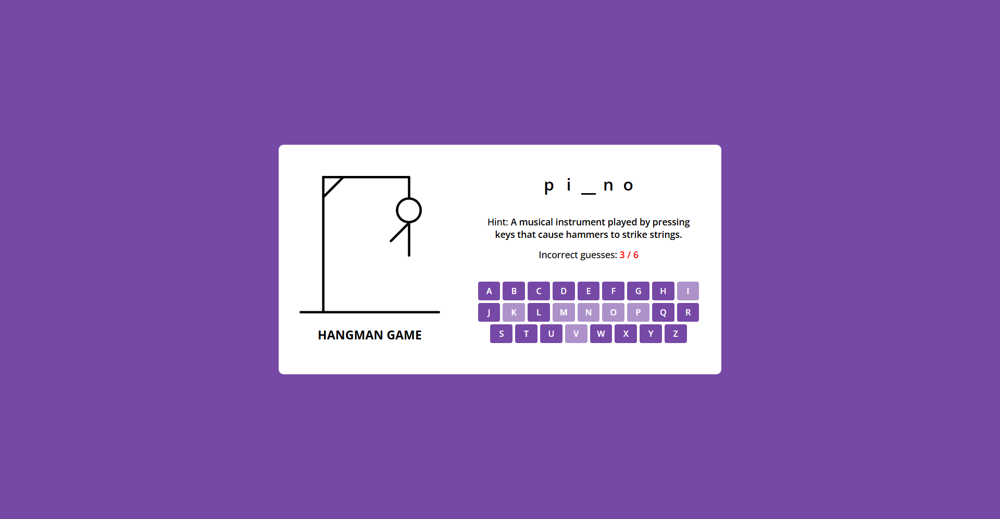

# Jogo da Forca

Um jogo da forca simples e interativo desenvolvido com HTML, CSS e JavaScript. O objetivo é adivinhar a palavra oculta selecionando letras, com um número limitado de tentativas disponíveis antes do fim do jogo.

## 🔥 Funcionalidades

* Geração dinâmica de palavras para uma experiência variada
* Sistema de dicas para auxiliar nas adivinhações
* Interface interativa com teclado virtual
* Funcionalidade de reinício do jogo
* Design responsivo

## 🛠️ Tecnologias Utilizadas

* HTML
* CSS
* JavaScript

## 🎮 Como Jogar

1. No início do jogo, uma palavra aleatória será selecionada e exibida como espaços em branco.
2. Clique nos botões do teclado virtual ou digite letras para fazer as adivinhações.
3. Adivinhações corretas revelam as letras correspondentes na palavra.
4. Adivinhações incorretas reduzem o número de tentativas restantes.
5. O jogo termina quando a palavra é completamente adivinhada ou as tentativas se esgotam.

## 🚀 Instalação

1. Clone o repositório:

   ```bash
   git clone https://github.com/seuusuario/jogo-da-forca.git
   ```
2. Acesse a pasta do projeto:

   ```bash
   cd jogo-da-forca
   ```
3. Abra o arquivo `index.html` em um navegador para começar a jogar.

## 📂 Estrutura do Projeto

* `index.html` - Estrutura HTML principal.
* `styles.css` - Estilo e layout do jogo.
* `script.js` - Lógica e funcionalidades do jogo.

## 📈 Melhorias Futuras

* Implementar sistema de pontuação e ranking
* Adicionar níveis de dificuldade
* Incluir animações e efeitos sonoros para feedback visual e auditivo
* Ajustes no design para dispositivos móveis

## 📸 Demonstração

Aqui você pode adicionar uma imagem ou GIF do jogo em funcionamento:

```markdown

```

---

## 📜 Licença

Este projeto é open-source e está licenciado sob a Licença MIT.
